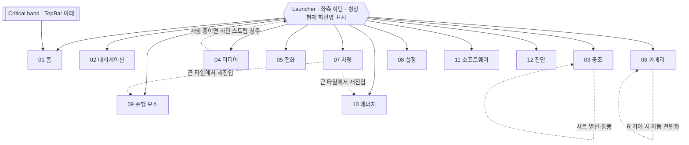

# OAS Automotive OS — UX Architecture

기준 문서다. 화면보다 먼저 결정되며, 개별 화면은 이 문서의 구조를 구현할 뿐 새 구조를 만들지 않는다.

관련 문서: [Design Tokens](01-DESIGN-TOKENS.md) · [Component System](02-COMPONENT-SYSTEM.md) · [Interaction Spec](03-INTERACTION-SPEC.md)

## 1. 제품 원칙

| 원칙 | 구현 규칙 |
| --- | --- |
| Driver-first | 주행 중 판단에 필요한 정보(속도·기어·다음 안내·경고)는 어떤 화면에서도 최소 한 곳에 상주한다. |
| Minimal | 장식 요소를 만들지 않는다. 모든 픽셀은 상태를 전달하거나 조작 대상이다. |
| 2 Touch | 런처 1 touch + 목적지 1 touch로 12개 화면 어디든 닿는다. 각 화면 안의 주요 조작은 추가 1 touch 이내. 3단계 이상 depth 금지. |
| Undivided screen | 상시 Dock을 두지 않는다. 화면은 TopBar와 런처 행을 뺀 전부를 그리드에 내준다. |
| Progressive disclosure | 상세·저빈도 정보는 기본 숨김. 정차 또는 명시적 진입에서만 확장한다. |
| Truthful state | 공급자가 없는 값은 비워두거나 "연결 전"으로 표시한다. 합성하지 않는다. 데모 경로만 예외이며 항상 SYNTHETIC을 표기한다. |
| Reactive | UI는 Vehicle State의 파생이다. UI가 차량 상태를 소유하거나 추정하지 않는다. |

## 2. 시스템 계층

```
┌─ Presentation ─────────────────────────────────────────┐
│  Screens (12)      ← 조합만 담당, 상태 소유 금지        │
│  Components (20)   ← Design Token만 참조                │
│  Design Tokens     ← 단일 진실 공급원                   │
├─ State ────────────────────────────────────────────────┤
│  UiState           ← page, panel, theme, selection      │
│  VehicleModel      ← 차량 도메인의 읽기 전용 정규화 뷰  │
├─ Provider ─────────────────────────────────────────────┤
│  VehicleStateBridge  (실데이터: HmiState protobuf)      │
│  Nav / Climate / Energy / Adas / Media / Lights / Tire  │
│    → 각각 connected 플래그를 가진 추상 Provider         │
├─ Platform ─────────────────────────────────────────────┤
│  Runtime (안전 정책 소유) ← Gateway ← CAN               │
└────────────────────────────────────────────────────────┘
```

**UI State와 Vehicle State는 분리한다.** UI State는 어떤 화면을 보고 있는지, 어떤 패널이 열렸는지만 안다. Vehicle State는 차량이 무엇을 하고 있는지만 안다. 둘의 결합은 화면에서만 일어난다.

### Provider 계약

모든 도메인 Provider는 동일한 3속성을 가진다.

| 속성 | 의미 |
| --- | --- |
| `connected` | 공급자가 연결되었는가. false면 화면은 EmptyState를 그린다. |
| `synthetic` | 값이 데모 주입인가. true면 화면 상단에 SYNTHETIC 배지가 상주한다. |
| `<signal>Valid` | 신호 단위 유효성. 연결되어도 개별 신호는 불명일 수 있다. |

값이 `Valid`가 아니면 숫자 자리에 `—`를 표시한다. 0이나 마지막 값을 표시하지 않는다.

### 현재 신호 소유 현황

| 도메인 | 계약 존재 | Bridge 노출 | 비고 |
| --- | --- | --- | --- |
| speed, gear | ✅ | ✅ | |
| doors, seatbelts | ✅ | ✅ (본 작업에서 추가) | 차량 시각화의 실데이터 |
| steering, brake, accelerator | ✅ | ✅ (본 작업에서 추가) | 조향 연동 시각화 |
| cruise, wheelSpeeds | ✅ | ✅ (본 작업에서 추가) | |
| nightMode | ✅ | ✅ | 자동 테마 입력 |
| freshness, capability | ✅ | ✅ | Runtime 소유. HMI는 재구현 금지 |
| rawSignals | ✅ | ✅ (본 작업에서 추가) | Diagnostics 전용 |
| navigation | ❌ | — | Provider stub, 데모 주입 |
| climate | ❌ | — | Provider stub, 데모 주입 |
| energy (battery/fuel/range) | ❌ | — | Provider stub, 데모 주입 |
| adas (lane/surround/sensor) | ❌ | — | Provider stub, 데모 주입 |
| media (track/source) | ❌ | — | Provider stub, 데모 주입 |
| lights, tires | ❌ | — | Provider stub, 데모 주입 |

## 3. Information Architecture



### 목적지 (런처, 12)

런처 메뉴에는 **모든 목적지가 한 화면에** 있다. 1차/2차 구분이 없으므로 어떤 화면도 다른 화면 뒤에 숨지 않는다.

| # | 목적지 | 목적 | 주행 중 |
| --- | --- | --- | --- |
| 01 | 홈 | 차량 식별, 측정값 그리드, 도어·안전벨트, 다음 안내 | 전체 |
| 02 | 내비게이션 | 지도 중심. 경로·ETA·다음 안내·교통·POI | 텍스트 입력 제외 |
| 03 | 공조 | 듀얼존 온도, 팬, 시트 열선·통풍, 디프로스트 | 전체 |
| 04 | 미디어 | Expanded Player. 플레이리스트·소스·볼륨 | 목록 축약 |
| 05 | 전화 | 페어링, 최근·즐겨찾기 | 다이얼 패드 잠금 |
| 06 | 카메라 | 후방·서라운드·전방 뷰, 주차 센서 | R 기어 자동 |
| 07 | 차량 | 차량 제어 카테고리 허브 | 일부 항목 잠금 |
| 08 | 설정 | 화면·오디오·안전·단위·정보 | 일부 항목 잠금 |
| 09 | 주행 보조 | 차로·주변 차량 시각화, 보조 시스템 | 전체 |
| 10 | 에너지 | 잔량·주행 가능 거리·전비·타이어 | 전체 |
| 11 | 소프트웨어 | 버전, 변경 사항, 설치 | **잠금** |
| 12 | 진단 | 스트림 상태, 신호 유효성, 원시 CAN | **잠금** |

런처 버튼은 **항상 현재 화면명을 표시한다.** 메뉴를 열지 않아도 어디에 있는지 알 수 있어야, 2터치 구조가 방향 감각을 해치지 않는다.

잠긴 목적지는 메뉴에서 **흐리게 + 사유와 함께 남는다.** 사라지면 운전자가 더 오래 찾는다.

### 시트 제어의 소유

시트 열선·통풍은 독립 목적지가 아니라 **Climate가 소유**한다. 공조 조작과 동일한 맥락·동일한 빈도이기 때문이다. Climate 화면에서 시트 컨트롤은 스크롤 없이 보인다.

### 전역 상주 레이어

| 레이어 | 위치 | 규칙 |
| --- | --- | --- |
| TopBar | 상단 72 | 제품 마크, 현재 화면, 연결 상태, SYNTHETIC, 실외 온도, 시각, 테마. 어떤 화면도 덮지 않는다. |
| Critical band | TopBar 아래 전폭 | 조건 발생 시에만. 닫을 수 없다. |
| Launcher | 좌측 하단 | 항상 표시. 현재 화면명을 표시한다. |
| Transport strip | 런처 우측 | **재생 중일 때만.** 런처는 행에 남으므로 화면이 가려지지 않는다. |
| LauncherMenu | 런처 위 | 12개 목적지. scrim으로 뒤를 누른다. |
| Toast | 런처 위 중앙 | 3초. 안전 정보에는 쓰지 않는다. |

## 4. Main Screen Wireframe

화면 외곽 여백은 0이다. 그리드가 가장자리까지 간다.

### regular (1920×1080)

```
┌──────────────────────────────────────────────────────────────────────────┐
│ ▣ 홈  ■연결됨 ■합성 상태                      실외 18.5°C  23:00   [◐]  │ 72
├─────────────────────────────────────────────────────┬────────────────────┤
│ 9NXR472                                             │                    │
│ 팰리세이드 2020                                      │   [ 차량 탑뷰 ]    │ 312
│ 기어 P    상태 스트림 fresh    제어 권한 없음          │                    │
├──────────────┬──────────────┬──────────────┬────────┴────────────────────┤
│ 속도          │ 에너지        │ 주행 가능 거리 │ 실내 온도      동승석 22.0 │
│ 0 km/h       │ 68 %         │ 412 km       │ 21.5 °C                    │
│ ▁▃▅█▄▃       │ ▓▓▓▓▓░░      │              │                            │
├──────────────┼──────────────┼──────────────┼────────────────────────────┤
│ 조향각        │ 가속도        │ 크루즈        │ 브레이크                    │
│ 0°           │ 0.0 m/s²     │ 꺼짐          │ 밟음                        │
├──────────────┴──────────────┴──┬───────────┴────────────────────────────┤
│ 도어 · 안전벨트        ■신호 수신 │ 다음 안내 ›                    ■서행   │
│ 도어     ●●●●                   │  ↰  450 m                             │
│ 안전벨트  ●●●●                   │     테헤란로 · 도착 14:58 · 12.4 km    │
├──────────────┬──────────────────┴────────────────────────────────────────┤
│ ☰ 메뉴 / 홈   │ ♪ Nocturne in E-flat major        ⏮  ⏸  ⏭              │ 72
└──────────────┴───────────────────────────────────────────────────────────┘
```

하단 우측 스트립은 **재생 중일 때만** 나타나고, 그 외에는 `bg`로 비어 런처만 남는다.

### 런처 메뉴 (펼친 상태)

```
┌──────────────────────────────────────────────────────────────────────────┐
│                          (scrim으로 눌린 현재 화면)                        │
│  ┌────────┬────────┬────────┬────────┐                                  │
│  │ ⌂ 홈   │ ◈ 내비 │ ❄ 공조 │ ♪ 미디어│  ← 현재 화면은 ink 채움           │
│  ├────────┼────────┼────────┼────────┤                                  │
│  │ ☏ 전화 │ ⊡ 카메라│ ⊟ 차량 │ ⚙ 설정 │                                  │
│  ├────────┼────────┼────────┼────────┤                                  │
│  │ ◇ ADAS │ ▭ 에너지│ ↓ SW   │ ∿ 진단 │  ← 주행 중 잠김은 사유와 함께 흐림 │
│  └────────┴────────┴────────┴────────┘                                  │
├──────────────┬───────────────────────────────────────────────────────────┤
│ ☰ 메뉴 / 홈   │                                                           │
└──────────────┴───────────────────────────────────────────────────────────┘
```

### compact (1280×720)

메트릭이 2열로 접히고 차량 셀이 좁아진다. TopBar 64, 런처 64. 스크롤 없이 모든 주요 조작에 닿는다.

### ultrawide (3840×1200)

메트릭이 6열이 된다. 그리드가 가로로 늘어날 뿐 구조는 같다.

## 5. 반응형 규칙

| Breakpoint | 폭 | 종횡비 | 레이아웃 |
| --- | --- | --- | --- |
| `compact` | < 1600 | — | 메트릭 2열, 차량 허브 2열. TopBar·런처 64px. |
| `regular` | 1600–2299 | < 2.2 | 메트릭 4열, 차량 허브 3열. TopBar·런처 72px. |
| `wide` | 2300–3199 | < 2.6 | 메트릭 4열, 차량 허브 4열. |
| `ultrawide` | ≥ 3200 또는 종횡비 ≥ 2.6 | — | 메트릭 6열. 홈에 지도 영구 표시. |

**절대 위치를 쓰지 않는다.** 모든 화면은 12-column adaptive grid의 column span으로 배치한다. 대상 해상도 1280×720 / 1920×1080 / 2560×1440 / 3840×1200 전부에서 스크롤 없이 주요 조작에 닿아야 한다.

## 6. 주행 상태별 노출 정책

`driving = speedValid && speed > 3 km/h`

| 요소 | 정차 | 주행 |
| --- | --- | --- |
| 런처 12 목적지 | 전체 | Software·Diagnostics 잠금 |
| 온도·팬·시트 | 전체 | 전체 |
| 목적지 텍스트 입력 | 허용 | **잠금** (음성·즐겨찾기만) |
| 플레이리스트 스크롤 | 전체 | 최근 8개로 제한 |
| Vehicle 허브 항목 | 전체 | Service·Software·Diagnostics 잠금 |
| 영상 재생 surface | Runtime 정책 | Runtime 정책 (HMI가 재판단하지 않음) |
| Modal | 허용 | 안전 경고만 |

잠금은 항목을 숨기는 것이 아니라 비활성 + 사유 표시다. 운전자가 "사라졌다"고 오인하지 않게 한다.

## 7. 화면 목록

| # | 화면 | 진입 | 주 데이터원 |
| --- | --- | --- | --- |
| 01 | Home / Vehicle | 런처 | Bridge (실데이터) |
| 02 | Navigation | 런처 | NavProvider |
| 03 | Media | 런처 | MediaProvider + Runtime capability |
| 04 | Climate | 런처 | ClimateProvider |
| 05 | Vehicle Controls | 런처 | 허브 |
| 06 | ADAS | 런처 | AdasProvider |
| 07 | Energy | 런처 | EnergyProvider |
| 08 | Camera | 런처 / R 기어 | CameraProvider |
| 09 | Phone | 런처 | PhoneProvider |
| 10 | Settings | 런처 | UiState |
| 11 | Software Update | 런처 | UpdateProvider |
| 12 | Diagnostics | 런처 | Bridge rawSignals (실데이터) |

12개 화면은 서로 다른 앱이 아니다. 동일한 TopBar, 동일한 런처, 동일한 `GridBoard`·`Cell`·`Metric`, 동일한 전환 모션을 공유한다. 화면 간 이동에 로딩·스플래시·앱 아이콘이 없다.
