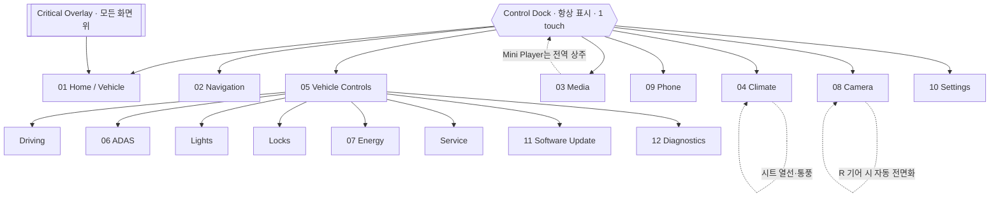

# OAS Automotive OS — UX Architecture

기준 문서다. 화면보다 먼저 결정되며, 개별 화면은 이 문서의 구조를 구현할 뿐 새 구조를 만들지 않는다.

관련 문서: [Design Tokens](01-DESIGN-TOKENS.md) · [Component System](02-COMPONENT-SYSTEM.md) · [Interaction Spec](03-INTERACTION-SPEC.md)

## 1. 제품 원칙

| 원칙 | 구현 규칙 |
| --- | --- |
| Driver-first | 주행 중 판단에 필요한 정보(속도·기어·다음 안내·경고)는 어떤 화면에서도 최소 한 곳에 상주한다. |
| Minimal | 장식 요소를 만들지 않는다. 모든 픽셀은 상태를 전달하거나 조작 대상이다. |
| 1–2 Touch | Dock의 8개 목적지는 1 touch. 각 목적지 안의 모든 주요 조작은 추가 1 touch 이내. 3단계 이상 depth 금지. |
| Progressive disclosure | 상세·저빈도 정보는 기본 숨김. 정차 또는 명시적 진입에서만 확장한다. |
| Truthful state | 공급자가 없는 값은 비워두거나 "연결 전"으로 표시한다. 합성하지 않는다. 데모 경로만 예외이며 항상 SYNTHETIC을 표기한다. |
| Reactive | UI는 Vehicle State의 파생이다. UI가 차량 상태를 소유하거나 추정하지 않는다. |

## 2. 시스템 계층

```
┌─ Presentation ─────────────────────────────────────────┐
│  Screens (12)      ← 조합만 담당, 상태 소유 금지        │
│  Components (20)   ← Design Token만 참조                │
│  Design Tokens     ← 단일 진실 공급원                   │
├─ State ────────────────────────────────────────────────┤
│  UiState           ← page, panel, theme, selection      │
│  VehicleModel      ← 차량 도메인의 읽기 전용 정규화 뷰  │
├─ Provider ─────────────────────────────────────────────┤
│  VehicleStateBridge  (실데이터: HmiState protobuf)      │
│  Nav / Climate / Energy / Adas / Media / Lights / Tire  │
│    → 각각 connected 플래그를 가진 추상 Provider         │
├─ Platform ─────────────────────────────────────────────┤
│  Runtime (안전 정책 소유) ← Gateway ← CAN               │
└────────────────────────────────────────────────────────┘
```

**UI State와 Vehicle State는 분리한다.** UI State는 어떤 화면을 보고 있는지, 어떤 패널이 열렸는지만 안다. Vehicle State는 차량이 무엇을 하고 있는지만 안다. 둘의 결합은 화면에서만 일어난다.

### Provider 계약

모든 도메인 Provider는 동일한 3속성을 가진다.

| 속성 | 의미 |
| --- | --- |
| `connected` | 공급자가 연결되었는가. false면 화면은 EmptyState를 그린다. |
| `synthetic` | 값이 데모 주입인가. true면 화면 상단에 SYNTHETIC 배지가 상주한다. |
| `<signal>Valid` | 신호 단위 유효성. 연결되어도 개별 신호는 불명일 수 있다. |

값이 `Valid`가 아니면 숫자 자리에 `—`를 표시한다. 0이나 마지막 값을 표시하지 않는다.

### 현재 신호 소유 현황

| 도메인 | 계약 존재 | Bridge 노출 | 비고 |
| --- | --- | --- | --- |
| speed, gear | ✅ | ✅ | |
| doors, seatbelts | ✅ | ✅ (본 작업에서 추가) | 차량 시각화의 실데이터 |
| steering, brake, accelerator | ✅ | ✅ (본 작업에서 추가) | 조향 연동 시각화 |
| cruise, wheelSpeeds | ✅ | ✅ (본 작업에서 추가) | |
| nightMode | ✅ | ✅ | 자동 테마 입력 |
| freshness, capability | ✅ | ✅ | Runtime 소유. HMI는 재구현 금지 |
| rawSignals | ✅ | ✅ (본 작업에서 추가) | Diagnostics 전용 |
| navigation | ❌ | — | Provider stub, 데모 주입 |
| climate | ❌ | — | Provider stub, 데모 주입 |
| energy (battery/fuel/range) | ❌ | — | Provider stub, 데모 주입 |
| adas (lane/surround/sensor) | ❌ | — | Provider stub, 데모 주입 |
| media (track/source) | ❌ | — | Provider stub, 데모 주입 |
| lights, tires | ❌ | — | Provider stub, 데모 주입 |

## 3. Information Architecture



### 최상위 목적지 (Dock, 8)

| # | 목적지 | 목적 | 주행 중 |
| --- | --- | --- | --- |
| 01 | Home / Vehicle | 차량 상태 시각화, 속도·기어, 다음 안내·미디어·공조 요약 | 전체 |
| 02 | Navigation | 지도 중심. 경로·ETA·다음 안내·교통·충전/주유 | 전체 (텍스트 입력 제외) |
| 03 | Media | Expanded Player. 플레이리스트·소스·사운드 | 목록 스크롤 제한 |
| 04 | Climate | 듀얼존 온도, 팬, 시트 열선·통풍, 디프로스트 | 전체 |
| 05 | Vehicle | 차량 제어 카테고리 허브 | 일부 항목 잠금 |
| 06 | Camera | 후방·서라운드·전방 뷰, 주차 센서 | R 기어 자동 |
| 07 | Phone | 페어링, 최근·즐겨찾기 | 다이얼 패드 잠금 |
| 08 | Settings | 화면·오디오·단위·안전·정보 | 일부 항목 잠금 |

Dock은 8개를 넘기지 않는다. 9번째 기능이 필요하면 기존 목적지 안의 2차 목적지로 들어간다.

### 2차 목적지 (Vehicle 허브 안, 1 touch 추가)

Driving · ADAS · Lights · Locks · Display · Energy · Service · Software Update · Diagnostics

큰 버튼 그리드(2×N, 각 타일 ≥ 120px 높이)로 배치한다. 리스트를 쓰지 않는다.

### 시트 제어의 소유

브리프의 "Seat"는 독립 Dock 항목으로 두지 않고 **Climate가 소유**한다. 시트 열선·통풍은 공조 조작과 동일한 맥락·동일한 빈도이며, Dock 항목을 하나 절약해 Camera를 1 touch로 올리는 편이 주행 안전에 유리하다. Climate 화면에서 시트 컨트롤은 스크롤 없이 보인다.

### 전역 상주 레이어

| 레이어 | 위치 | 규칙 |
| --- | --- | --- |
| Status Rail | 상단 56px | 시각, 연결 상태, SYNTHETIC 배지, 온도 요약, 테마. 어떤 화면도 가리지 않는다. |
| Control Dock | 하단 floating | 항상 표시. 화면 전환으로 사라지지 않는다. |
| Media Mini Player | Dock 위 우측 | 재생 중일 때만. Media 화면에서는 숨긴다(중복 방지). |
| Critical Overlay | 전면 | 도어 열림 주행, 안전벨트 미착용, stale 상태 등. 닫을 수 없고 조건 해제로만 사라진다. |
| Toast | Dock 위 중앙 | 3초. 상태 변경의 즉각 피드백. 조작을 막지 않는다. |

## 4. Main Screen Wireframe

### regular (1920×1080, 16:9) — 3 zone

```
┌──────────────────────────────────────────────────────────────────────────┐
│ 14:32   ● 연결됨          o a s          SYNTHETIC    21.5°   ☾         │ 56
├───────────────┬──────────────────────────────────┬───────────────────────┤
│ DRIVE         │                                  │ 다음 안내             │
│               │                                  │  ↰  450 m             │
│   ８７        │        [ Vehicle Visual ]        │  테헤란로            │
│   km/h        │                                  │  ETA 14:58 · 12 km   │
│               │     도어·조명·조향 실시간 반영    │                       │
│  P R N ⟦D⟧    │                                  ├───────────────────────┤
│               │                                  │ 미디어                │
├───────────────┤                                  │ ▣  Track              │
│ 주행거리       │                                  │    Artist             │
│  412 km       │                                  │  ⏮  ⏸  ⏭            │
│               │                                  ├───────────────────────┤
│ 에너지         │      ● ● ● ● 도어 상태          │ 공조                  │
│  ▰▰▰▰▱ 68%   │      ● 안전벨트                  │ 21.5°  ⟷  22.0°     │
│               │                                  │ 팬 ▰▰▰▱▱   시트 ♨   │
├───────────────┴──────────────────────────────────┴───────────────────────┤
│        ⌂      ◈      ❄      ♪      ☏      ⊡      ⚙      ⋯              │ 88
│       홈    내비   공조   미디어  전화  카메라  차량   설정               │
└──────────────────────────────────────────────────────────────────────────┘
   360px            fill (≥ 640)                    360px
```

좌열은 **주행 데이터**(운전자 시선에 가장 가까운 쪽), 중앙은 **차량 시각화**, 우열은 **다음 행동**(안내·미디어·공조)이다. 좌열과 중앙은 주행 중에도 내용이 바뀌지 않는다.

### compact (1280×720, 1366×768) — 2 zone

```
┌────────────────────────────────────────────────┐
│ 14:32  ● 연결됨      o a s        21.5°  ☾    │ 56
├────────────────────┬───────────────────────────┤
│ ８７ km/h  ⟦D⟧     │  다음 안내  ↰ 450 m      │
│                    ├───────────────────────────┤
│  [ Vehicle Visual ]│  미디어                   │
│                    ├───────────────────────────┤
│  ● ● ● ●  도어     │  공조 21.5° ⟷ 22.0°     │
├────────────────────┴───────────────────────────┤
│   ⌂   ◈   ❄   ♪   ☏   ⊡   ⚙   ⋯             │ 80
└────────────────────────────────────────────────┘
```

좌열의 주행 지표가 중앙 stage 상단으로 병합된다. 우열은 유지한다(다음 행동은 절대 숨기지 않는다).

### ultrawide (3840×1200, 32:10) — 4 zone

```
┌──────────────────────────────────────────────────────────────────────────────────────────┐
│ 14:32   ● 연결됨                       o a s                        21.5°   ☾           │ 64
├──────────────┬────────────────────────┬───────────────────────────────┬──────────────────┤
│ DRIVE        │                        │                               │ 다음 안내        │
│  ８７        │   [ Vehicle Visual ]   │      [ Map Surface ]          │  ↰ 450 m        │
│  km/h        │                        │      영구 표시                │                  │
│ ⟦D⟧          │    도어·조명 반영       │                               │ 미디어           │
│              │                        │                               │                  │
│ 에너지 68%   │    ● ● ● ●            │                               │ 공조             │
├──────────────┴────────────────────────┴───────────────────────────────┴──────────────────┤
│              ⌂     ◈     ❄     ♪     ☏     ⊡     ⚙     ⋯                              │ 96
└──────────────────────────────────────────────────────────────────────────────────────────┘
  320          fill(0.9x)              fill(1.4x)                        360
```

ultrawide에서는 지도를 Home에 영구 배치한다. 화면 전환 없이 지도와 차량을 동시에 본다 — 브리프의 "화면 전환 최소화"가 가장 크게 실현되는 구간이다.

## 5. 반응형 규칙

| Breakpoint | 폭 | 종횡비 | 레이아웃 |
| --- | --- | --- | --- |
| `compact` | < 1600 | — | 2 zone. 좌 정보열을 stage에 병합. Dock 80px. |
| `regular` | 1600–2299 | < 2.2 | 3 zone (360 / fill / 360). Dock 88px. |
| `wide` | 2300–3199 | < 2.6 | 3 zone (400 / fill / 400). 타일 2열 → 3열. Dock 88px. |
| `ultrawide` | ≥ 3200 또는 종횡비 ≥ 2.6 | — | 4 zone. 지도 영구 표시. Dock 96px. |

**절대 위치를 쓰지 않는다.** 모든 화면은 12-column adaptive grid의 column span으로 배치한다. 대상 해상도 1280×720 / 1920×1080 / 2560×1440 / 3840×1200 전부에서 스크롤 없이 주요 조작에 닿아야 한다.

## 6. 주행 상태별 노출 정책

`driving = speedValid && speed > 3 km/h`

| 요소 | 정차 | 주행 |
| --- | --- | --- |
| Dock 8 목적지 | 전체 | 전체 |
| 온도·팬·시트 | 전체 | 전체 |
| 목적지 텍스트 입력 | 허용 | **잠금** (음성·즐겨찾기만) |
| 플레이리스트 스크롤 | 전체 | 최근 8개로 제한 |
| Vehicle 2차 목적지 | 전체 | Service·Software·Diagnostics 잠금 |
| 영상 재생 surface | Runtime 정책 | Runtime 정책 (HMI가 재판단하지 않음) |
| Modal | 허용 | 안전 경고만 |

잠금은 항목을 숨기는 것이 아니라 비활성 + 사유 표시다. 운전자가 "사라졌다"고 오인하지 않게 한다.

## 7. 화면 목록

| # | 화면 | 진입 | 주 데이터원 |
| --- | --- | --- | --- |
| 01 | Home / Vehicle | Dock | Bridge (실데이터) |
| 02 | Navigation | Dock | NavProvider |
| 03 | Media | Dock | MediaProvider + Runtime capability |
| 04 | Climate | Dock | ClimateProvider |
| 05 | Vehicle Controls | Dock | 허브 |
| 06 | ADAS | Vehicle | AdasProvider |
| 07 | Energy | Vehicle | EnergyProvider |
| 08 | Camera | Dock / R 기어 | CameraProvider |
| 09 | Phone | Dock | PhoneProvider |
| 10 | Settings | Dock | UiState |
| 11 | Software Update | Vehicle | UpdateProvider |
| 12 | Diagnostics | Vehicle | Bridge rawSignals (실데이터) |

12개 화면은 서로 다른 앱이 아니다. 동일한 Status Rail, 동일한 Dock, 동일한 Panel·Tile·Readout 컴포넌트, 동일한 전환 모션을 공유한다. 화면 간 이동에 로딩·스플래시·앱 아이콘이 없다.
