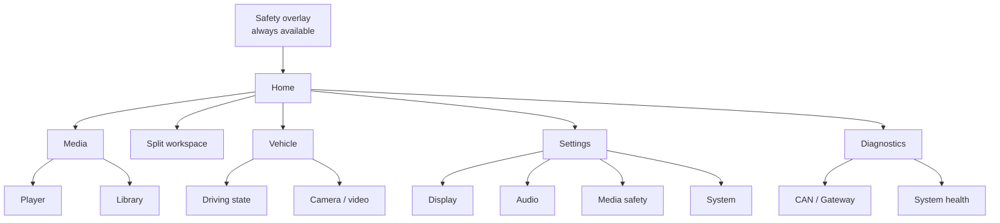

# OAS VehicleState Viewer information architecture

초기 HMI는 read-only 상태와 미디어를 중심으로 하며, Vehicle에는 hardware integration 전까지 로컬 UI 시뮬레이션 Comfort Control을 둔다. 깊은 메뉴보다 상단의 여섯 최상위 목적지를 고정하고, 안전 상태는 어느 화면에서도 우선한다. 시각 언어는 제품 HMI와 같은 Grid 시스템이며, 정의는 [design system](DESIGN_SYSTEM.md)에 있다.

## Global safety overlay

`locked` 또는 `unknown` 상태에서는 현재 화면 위에 안전 배너를 유지한다. 미디어의 재생 surface는 즉시 숨기고 이유와 복구 조건을 표시한다. 이 overlay는 메뉴가 아니며 닫을 수 없다.

## Top-level destinations

| Destination | MVP | Purpose |
| --- | --- | --- |
| Home | Yes | 현재 안전 상태, 속도·기어, 현재 미디어의 요약과 다음 행동을 표시한다. |
| Media | Yes | 재생 surface와 라이브러리를 제공한다. 정책이 허용할 때만 재생 surface를 연다. |
| Split | Yes | 미디어와 공조를 2분할로 동시에 표시한다. |
| Vehicle | Yes | read-only 주행 상태, Comfort Control UI 시뮬레이션, 카메라·영상 입력을 표시한다. |
| Settings | Yes | 화면, 오디오, 미디어 안전, 시스템 설정을 소유한다. |
| Diagnostics | Yes | CAN·Gateway 연결, freshness, 시스템 health와 로그 export를 제공한다. |

## Settings ownership

`D 기어 정차 시 미디어 허용`은 **Settings → Media safety**만 소유한다. 기본값은 꺼짐이며, 설정을 켜도 이동·상태 불명·stale은 허용하지 않는다. 이 설정은 Home이나 Media에서 토글하지 않는다.

## Navigation rules

- Home은 부팅 후 첫 화면이며, 최상위 화면 간 이동은 한 번의 탭으로 끝난다.
- Media의 Player와 Library는 해당 화면 안의 tab으로 둔다. 독립 top-level 화면을 늘리지 않는다.
- Settings → Display에서 자동·라이트·다크 테마를 선택한다. 자동은 차량의 `nightMode` 신호를 우선하며, 신호가 없으면 밝은 화면을 유지한다.
- Comfort Control은 목표 온도, 풍량, A/C, 오디오 음량의 UI 상태만 변경한다. 현재는 CAN 송신이나 네트워크 요청을 만들지 않는다.
- Diagnostics의 쓰기 동작은 로그 export만 허용한다. CAN 송신이나 차량 제어는 제공하지 않는다.
- Vision은 실제 카메라 하드웨어·영상 pipeline이 준비될 때까지 숨긴다. 빈 메뉴를 노출하지 않는다.
